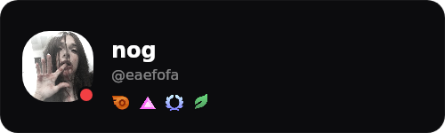

# NogBadges

Plugin para Vencord que permite adicionar badges customizadas ao seu perfil do Discord, modificar datas de assinatura Nitro/Boost e personalizar seu username visualmente.

> **Nota:** Este é um fork atualizado do [NogPlugin original](https://github.com/invejei/NogPlugin). A versão anterior quebrou devido a mudanças no Discord, então o plugin foi completamente reescrito com um novo método de badges mais estável.

## Recursos

- **38 Badges Disponíveis**: Staff, Partner, HypeSquad, Bug Hunter, Active Developer, Early Supporter, Nitro (todos os níveis), Server Boosts, e mais
- **Datas Customizadas**: Defina quando começou a assinar Nitro ou impulsionar servidores
- **Username Visual**: Altere como seu username aparece (apenas visual, não muda o @handle real)
- **Data de Criação da Conta**: Modifique a data "Membro desde" no seu perfil
- **Ocultar Badges Reais**: Opção para esconder suas badges originais e mostrar apenas as selecionadas
- **Interface Intuitiva**: Seleção visual de badges com preview dos ícones

## Screenshots

### Seleção de Badges


### Perfil com Badges Customizadas


### Tooltip de Nitro


### Página de Nitro


## Instalação

### Método 1: Modo Desenvolvedor (Recomendado)

Ideal para quem deseja editar e testar o plugin rapidamente.

**Pré-requisitos:**
- Node.js LTS
- Git
- Cliente com Vencord (Vesktop, Legcord ou Discord Desktop modificado)

**Passos:**

1. Clone o repositório do Vencord:
```bash
git clone https://github.com/Vendicated/Vencord
cd Vencord
```

2. Instale as dependências:
```bash
npm install
# ou
pnpm install
```

3. Clone este plugin para a pasta de plugins:
```bash
cd src/plugins
git clone https://github.com/SEU_USUARIO/NogBadges
```

4. Compile o Vencord:
```bash
npm run build
# ou
pnpm build
```

5. Abra o Discord com Vencord ativo (Vesktop/Legcord ou Discord Desktop com Vencord instalado)

6. Vá em **Configurações → Plugins** e ative **NogBadges**

**Para testar mudanças:**
- Recompile com `npm run build` ou `pnpm build`
- Reinicie o Discord ou desative/ative o plugin

**Notas:**
- Vesktop e Legcord já integram o Vencord, simplificando os testes
- Se usar o Vencord Installer no Discord Desktop, reexecute o installer após mudanças quando necessário
- No Windows, você pode usar `npm` ou `pnpm` conforme sua preferência

### Método 2: Injeção no Discord Desktop (Vencord Installer)

Se você não usa Vesktop/Legcord e quer o Vencord no Discord Desktop oficial:

**Método GUI (Recomendado):**

1. Feche completamente o Discord
2. Baixe o [Vencord Installer](https://github.com/Vencord/Installer/releases/latest)
3. Execute o Installer, selecione o canal (Stable/PTB/Canary) e clique em **Install**
4. Abra o Discord e verifique o Vencord em **Configurações → Plugins**
5. Após instalar o plugin, faça o build novamente e reinicie o Discord
6. Se necessário, reabra o Installer e use **Repair/Update**

**Método PowerShell (Alternativo):**

1. Abra o PowerShell como Administrador
2. Execute:
```powershell
irm https://raw.githubusercontent.com/Vencord/Installer/main/Install.ps1 | iex
```
3. Siga as instruções na tela para injetar no Discord desejado

**Desinstalação/Repair:**
- Use o próprio Installer para remover ou reparar a injeção
- Sempre feche o Discord antes de instalar/remover

## Como Usar

1. Abra as **Configurações do Discord**
2. Vá em **Plugins → NogBadges**
3. Configure as opções disponíveis:

### Opções Disponíveis

**Ocultar minhas badges reais**
- Remove suas badges originais do Discord
- Mostra apenas as badges que você selecionar

**Nome de usuário customizado**
- Digite um nome para alterar como seu username aparece
- Formato: texto livre
- Exemplo: `NogCustom`

**Data de criação da conta**
- Modifica a data "Membro desde" no perfil
- Formato: `YYYY-MM-DD`
- Exemplo: `2015-05-13`

**Data de início da assinatura Nitro**
- Define desde quando você "assina" o Nitro
- Afeta a barra de progresso e o tooltip
- Formato: `YYYY-MM-DD`
- Exemplo: `2020-01-15`

**Data de início do boost**
- Define desde quando você "impulsiona" servidores
- Formato: `YYYY-MM-DD`
- Exemplo: `2021-06-20`

**Seleção de Badges**
- Clique nas badges que deseja exibir
- Badges selecionadas ficam destacadas em azul
- Você pode selecionar quantas quiser

## Badges Disponíveis

### Badges Gerais (10)
- Discord Staff
- Partnered Server Owner
- Moderator Programs Alumni
- HypeSquad Events
- Bug Hunter Level 1 & 2
- Active Developer
- Early Supporter
- Nitro
- Early Verified Bot Developer

### Server Boosts (9)
- Boost 1 mês até 24 meses (9 níveis)

### HypeSquad Houses (5)
- Bravery, Brilliance, Balance
- Golden HypeSquad Balance
- King of the Hat HypeSquad Balance

### Bot/App Badges (4)
- Uses AutoMod
- Quest Completed
- Supports Commands
- Premium Bot

### Badges Especiais (2)
- Originally Known As (legacy username)
- Orb's Apprentice

### Nitro Tenure (8)
- Bronze (1 mês)
- Silver (3 meses)
- Gold (6 meses)
- Platinum (12 meses)
- Diamond (24 meses)
- Emerald (36 meses)
- Ruby (60 meses)
- Opal (72+ meses)

**Total: 38 badges disponíveis**

## Perguntas Frequentes

**Q: Outras pessoas podem ver minhas badges customizadas?**
A: Não. As badges são apenas visuais no seu cliente. Apenas você vê as modificações que fez.

**Q: Posso ser banido por usar este plugin?**
A: Modificações de cliente são contra os Termos de Serviço do Discord. Use por sua conta e risco.

**Q: As badges funcionam em mobile?**
A: Não. O plugin funciona apenas no Discord Desktop com Vencord instalado.

**Q: Posso usar múltiplas badges de Nitro ao mesmo tempo?**
A: Sim, mas o Discord normalmente mostra apenas uma badge de Nitro por vez.

**Q: A barra de progresso do Nitro funciona?**
A: Sim! A barra de progresso é calculada automaticamente baseado na data que você configurar.

## Contribuição

Se o plugin te ajudou, deixe uma estrela no GitHub e compartilhe com amigos!

**Pull Requests são bem-vindos** para:
- Melhorias na interface
- Novos recursos
- Correções de bugs
- Otimizações de código
- Documentação

### Como Contribuir

1. Fork este repositório
2. Crie uma branch para sua feature (`git checkout -b feature/MinhaFeature`)
3. Commit suas mudanças (`git commit -m 'Adiciona MinhaFeature'`)
4. Push para a branch (`git push origin feature/MinhaFeature`)
5. Abra um Pull Request

## Problemas Conhecidos

- As modificações são apenas visuais (client-side)
- Não funciona em Discord Web ou Mobile
- Requer Vencord instalado

## Changelog

### v2.0.0 (Atual)
- Reescrita completa do plugin
- Novo método de badges mais estável
- Adicionadas 38 badges
- Sistema de datas customizadas
- Interface visual melhorada
- Suporte para todos os níveis de Nitro

### v1.0.0 (Descontinuado)
- Versão original (quebrada)

## Licença

Este projeto é open-source e está disponível sob a licença MIT.

## Desenvolvedor

<table>
  <tr>
    <td>
      
    </td>
    <td>
      <h3>Nog</h3>
      <p>Desenvolvedor Principal</p>
      <p>Criador e mantenedor do NogBadges</p>
    </td>
  </tr>
</table>

---

**Aviso Legal:** Este plugin modifica o cliente do Discord e vai contra os Termos de Serviço. Use por sua conta e risco. O desenvolvedor não se responsabilizam por quaisquer consequências do uso deste plugin.
